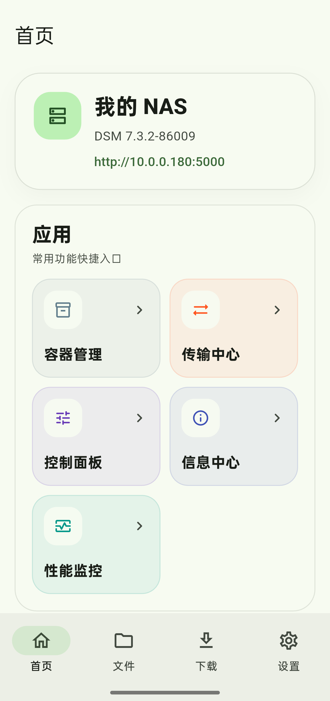
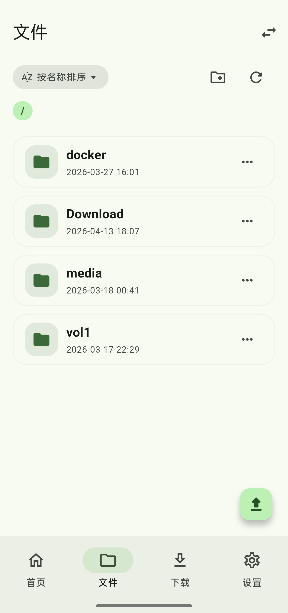
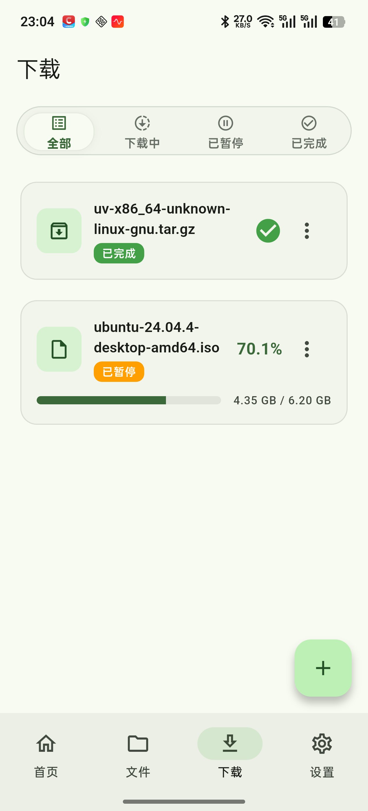
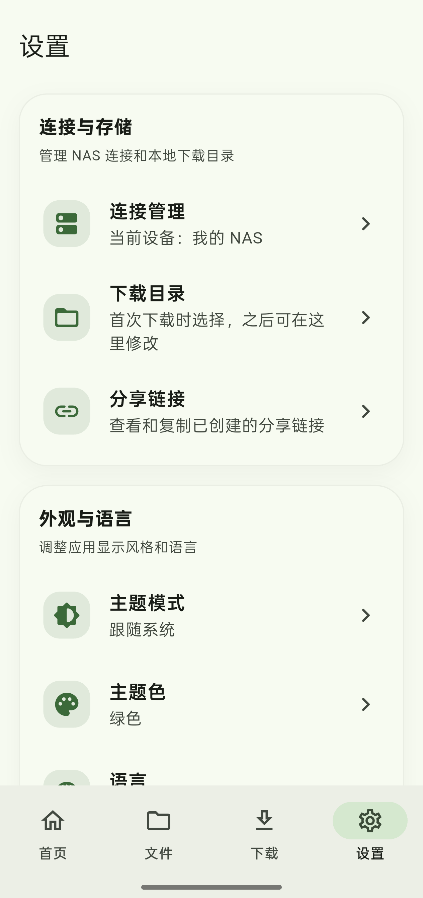
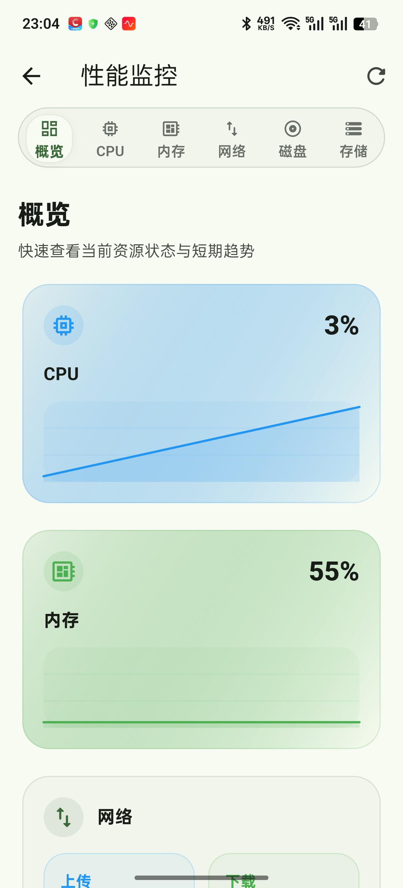
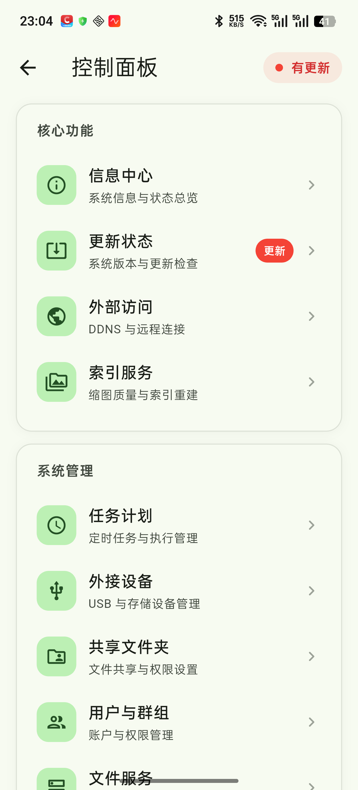

# 群晖管家

> ⚠️ **本项目为纯 AI 开发，功能均需在真实设备上测试验证后再投入生产使用。**

一款面向 **Synology DSM 7+** 的 Flutter 移动客户端，以现代移动体验为核心，覆盖 NAS 日常运维的核心场景。

## 截图

<p float="left">
  
  
  
</p>
<p float="left">
  
  
  
</p>

## 核心特性

### 全面的 DSM 系统集成

基于 Synology 官方 WebAPI 构建，覆盖认证、存储、网络、下载、容器、用户管理等多个子系统，共计 **20+ WebAPI 模块**，包括：

| 模块 | 说明 |
|------|------|
| `SYNO.Login` / `SYNO.Auth` | 登录与会话管理，支持 SynoToken 刷新与自动恢复 |
| `SYNO.DSM.Info` | 系统基本信息与版本 |
| `SYNO.Core.System` | 电源控制、重启、关机 |
| `SYNO.Core.SYSVM.Retention` | 存储快照管理 |
| `SYNO.FileStation` | 文件浏览、上传下载、分享链接、文本编辑 |
| `SYNO.DownloadStation2` | 下载任务管理（创建/暂停/恢复/删除） |
| `SYNO.PackageStation` | 套件中心：安装/卸载/启停/升级 |
| `SYNO.Docker.Container` | Docker 容器管理 |
| `SYNO.Core.Network` | 网络状态与网关配置 |
| `SYNO.Core.System.SystemInfo` | CPU、内存、存储实时状态 |
| `SYNO.Core.ExternalDevice` | 外接设备（UPS 等） |
| `SYNO.Core.Findmee` | 设备定位 |
| `SYNO.Core.UPnP` | UPnP 端口映射 |
| `SYNO.TaskScheduler` | 计划任务管理 |
| `SYNO.S2S.Server` | 远程服务器管理 |
| `SYNO.BandwidthControl` | 带宽控制 |
| `SYNO.Core.Security` | 安全扫描状态 |
| `SYNO.Virtualization` | 虚拟机管理 |
| `SYNO.IndexService` | 索引服务 |
| `SYNO.UserGroup` | 用户与群组管理 |
| `SYNO.Share` | 共享文件夹管理 |
| `SYNO.Terminal` | 终端（SSH/明文） |
| `SYNO.SurveillanceStation` | Surveillance Station 摄像头管理 |
| `SYNO.Backup.Server` | 备份任务管理 |
| `SYNO.Entry` | 复合请求（支持多 API 并行批量调用） |

### 稳定可靠的会话管理

- SynoToken + Session Cookie 双轨认证，登录状态持久化
- Realtime WebSocket 会话保活与自动恢复
- Dio 统一网络层，集成重试、日志、错误映射拦截器
- 网络抖动时无缝重连，用户无感知

### 现代化移动体验

- **Material Design 3** 主题，动态色彩、圆角、Elevation 体系
- **深色模式** 原生支持
- **多语言**（简体中文 / English）
- 文件列表支持**路径面包屑导航**，超宽时自动滚动至最新目录
- 下载任务卡片实时显示进度、速度、已下载/总大小
- 全局 Toast 通知 + 下载任务实时通知栏推送

## 技术架构

```
lib/
├── app/                      # 应用入口、路由、主题
├── core/                     # 公共基础设施
│   ├── constants/            # 全局常量
│   ├── error/                # 统一异常定义与映射
│   ├── network/              # Dio 实例、重连桥、会话拦截器
│   ├── services/             # 通知服务等全局服务
│   ├── storage/              # 本地存储、安全存储
│   ├── utils/                # 通用工具函数（格式化、日志、Toast 等）
│   └── widgets/              # 公共 UI 组件
├── data/                     # 数据层
│   ├── api/                  # 各 WebAPI 实现（20+ 模块）
│   ├── models/               # API 响应模型
│   └── repositories/         # Repository 具体实现
├── domain/                   # 领域层
│   ├── entities/             # 纯业务实体
│   └── repositories/          # Repository 接口定义
├── features/                 # 功能模块（按领域划分）
│   ├── auth/                 # 登录、会话
│   ├── dashboard/            # 系统概览、仪表盘
│   ├── downloads/            # 下载管理
│   ├── files/                # 文件浏览与管理
│   ├── information_center/   # 存储、网络详情
│   ├── packages/             # 套件中心
│   ├── performance/         # 性能监控与历史图表
│   ├── power/                # 电源控制
│   ├── server-management/    # 服务器管理
│   ├── settings/             # 设置与连接管理
│   ├── shared_folders/       # 共享文件夹
│   ├── task_scheduler/       # 计划任务
│   ├── terminal/             # 终端
│   ├── transfers/            # 传输管理
│   ├── user_groups/          # 用户与群组
│   └── ...                   # Docker、升级、日志等
└── l10n/                     # 国际化（ARB 驱动）
```

**状态管理**：Riverpod（Provider + AsyncNotifier），所有数据层和业务层完全解耦。

**路由**：GoRouter，支持深层链接和 Shell 路由架构。

## 当前功能模块

| 模块 | 能力 |
|------|------|
| **登录** | DSM 账号密码登录、服务器切换、登录状态持久化 |
| **仪表盘** | 系统状态总览、CPU / 内存 / 存储使用率、运行时间、套件入口 |
| **文件管理** | 共享文件夹浏览、文件预览、文本编辑、上传下载、创建/重命名/删除、分享链接生成 |
| **下载** | Download Station 任务列表、创建 URL/磁力任务、暂停/恢复/删除、进度实时轮询、详情弹窗 |
| **存储概览** | 各卷使用率、硬盘 SMART 状态、RAID 组信息、网络接口状态 |
| **性能监控** | CPU / 内存实时图表、历史趋势、指标卡片 |
| **套件中心** | 已安装 / 可更新过滤、包详情、启停 / 安装 / 卸载 / 升级 |
| **Docker** | 容器列表、镜像管理、创建/启停/删除 |
| **电源** | 关机、重启、进入/退出休眠、UPS 管理 |
| **用户管理** | 用户列表、群组管理 |
| **终端** | 内置 SSH 终端界面 |
| **计划任务** | 任务列表与启停管理 |
| **系统升级** | DSM 升级包检测与安装 |
| **设置** | 深色主题、多语言切换、服务器配置管理 |
| **调试日志** | App 本地日志查看与导出 |

## 构建说明

```bash
# 安装依赖
flutter pub get

# 代码分析（推送前必须保证 No issues found）
flutter analyze

# 运行调试
flutter run

# APK 构建（按 ABI 分包）
flutter build apk --release --split-per-abi --obfuscate --split-debug-info=build/app/outputs/symbols

# AAB 构建（Google Play 发布用）
flutter build appbundle --release --obfuscate --split-debug-info=build/app/outputs/symbols
```

## CI / CD

- **PR 检查**：每次 PR 自动运行 `flutter analyze`，不允许有 error / warning / info
- **Release 构建**：通过 `workflow_dispatch` 触发 Windows Build Agent 进行交叉编译，APK 自动上传

## License

当前仓库处于活跃迭代阶段，请勿作为最终发布版本使用。

---

感谢 [dsm_helper](https://gitee.com/apaipai/dsm_helper) 本开源项目，部分设计思路与实现参考自该项目。
